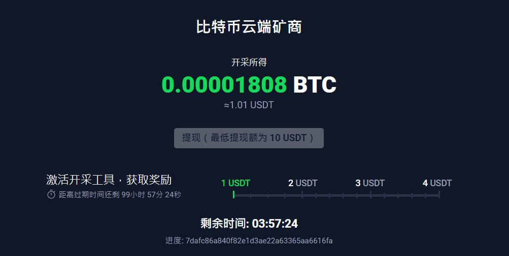
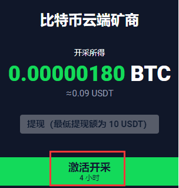
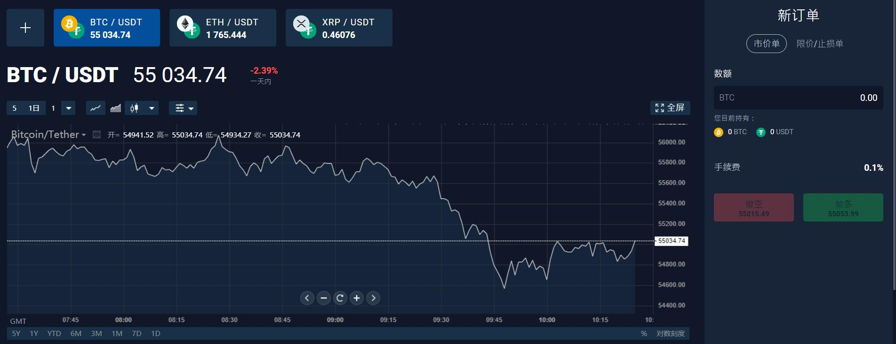
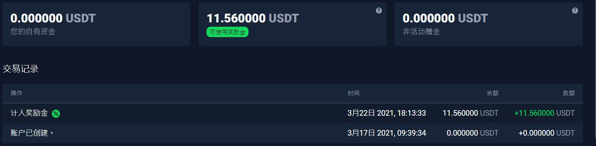

# shareEarnMoneyOnline | 网络赚钱分享

## StormGain_注册开启免费挖BTC,10USDT起提
StormGain有个比特币云端矿商服务，用户只需要一台可以连网的设备即可挖矿。

### 注册挖矿流程：
1 注册登录开启挖矿
注册链接：https://app.stormgain.com/friend/BNS29480493

必填邀请码：**BNS29480493**

填写邀请码即赠送3USDT

2 每四小时需要激活一次挖矿

### 问答：
问：为什么我无法进行提现操作？

无法提现可能有两个原因：

1. 最低提现额为 10 USDT（等值比特币），请查看您的提现金额是否达到最低额度。

2. 采矿操作仍在进行中。采矿进程中无法进行提现操作。请等开采结束后，再进行提现。

问：资金已扣除，但钱包中没有显示。

您的收益将转换为 USDT等值金额，并在 72 小时内计入您的 USDT 奖励金钱包

问：为什么开采所得金额有所减少?

您现在正在开采的事比特币（单位：聪）。提现的 USDT 金额可能会因 BTC/USDT 汇率和手续费而有所不同。

问：为什么我的开采速度变慢了？

进行开采的客户数量不断增加。因此，矿商的总体开采速度有所下降。我们必须对服务器资源进行分配，以向所有客户提供开采服务。

### 注意点：
挖矿所获收益转入奖励金钱包，据我查看该笔资金无法提现，只可用于交易，交易所获得的盈利可以提现。

所以，这是一个虚拟货币的交易平台，你可以通过做多做空虚拟币来获得投资盈利，云端挖矿只是一个吸引用户的噱头。

### 提现：
通过免费挖矿获得了11USDT，提现等了两天才到钱包的奖励金。

